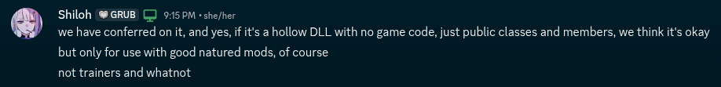

# White Knuckle Assembly References

This repository contains the publicized and stripped reference assemblies for the game White Knuckle. These files are provided to assist the modding community in building C# BepInEx mods targeting .NET Standard 2.1. 

## Developer Permission Notice

Before establishing this public resource, the monksilly team obtained explicit permission from the game developers to host and distribute these stripped assemblies. The developers granted permission for these files to be shared publicly since all proprietary game logic and intellectual property have been completely removed. 

To ensure full transparency with both the community and the platform, the monksilly team obtained formal permission before making this repository public. This infrastructure exists entirely within the scope of the permission provided by the development team. 

Below is documentation verifying that the monksilly team obtained permission from the game developers to publish these hollow reference libraries:



## Important Usage Restrictions: What NOT to Do

As specified by the development team in the provided permission documentation, these reference assemblies are strictly intended for the development of good-natured mods. 

**Do not use the assets in this repository to create:**
* **Trainers**
* **Cheats or hacks**
* **Other malicious tools that alter game balance or integrity**

The monksilly team obtained permission under the explicit condition that this repository would serve the constructive modding community, and any usage violating these boundaries goes against the developers' terms.

## What are these files?

These DLLs (such as `Assembly-CSharp.dll`) have been processed using a publicizer and stripper tool. 

* All method bodies have been completely hollowed out and replaced with `throw null;`. 
* They contain zero proprietary game code, assets, or executable logic.
* All class structures, fields, and compiler-generated types have been publicized to allow modders to compile their code cleanly against the game's architecture.

## How to Use

These references are packaged and distributed automatically via GitHub Packages as NuGet dependencies. 

### 1. Configure your nuget.config
To pull these assemblies into your mod project, add a `nuget.config` file to the root directory of your mod's repository:

```xml
<?xml version="1.0" encoding="utf-8"?>
<configuration>
  <packageSources>
    <clear />
    <add key="nuget.org" value="https://api.nuget.org/v3/index.json" />
    <add key="monksilly-feed" value="https://nuget.pkg.github.com/monksilly/index.json" />
  </packageSources>
</configuration>
```

### 2. Reference the Package

Add the following package reference to your mod's `.csproj` file.

To always target the latest available version of the game libraries, you can use a wildcard format:

```xml
<ItemGroup>
  <PackageReference Include="WhiteKnuckle.GameLibs" Version="0.55.*"/>
</ItemGroup>

```

## Version Mapping

The game utilizes a lettering system for minor updates (e.g., 0.55a, 0.55b). Because NuGet requires strict semantic versioning numbers, the versions are mapped as follows:

* Game version `0.55a` -> NuGet package version `0.55.1`
* Game version `0.55b` -> NuGet package version `0.55.2`
* And so on.

## Disclaimer

This repository is maintained by the monksilly team. **It is not an official product of the White Knuckle developers**, though the team obtained permission to host these specific reference files **for community modding purposes**.